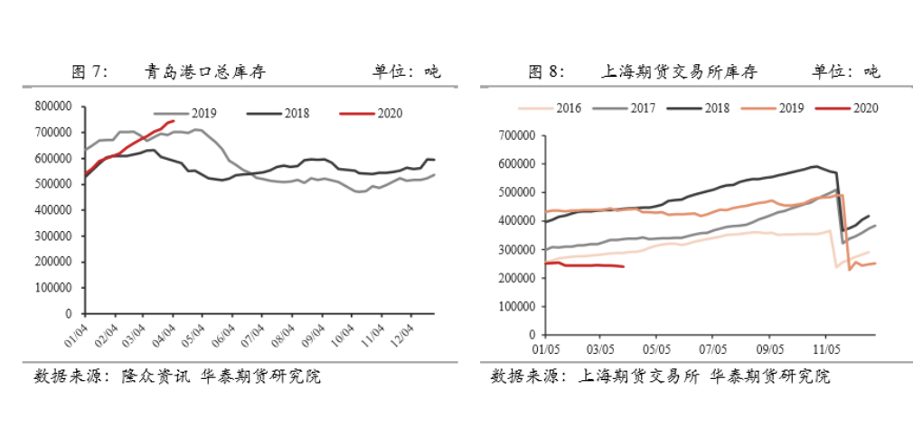
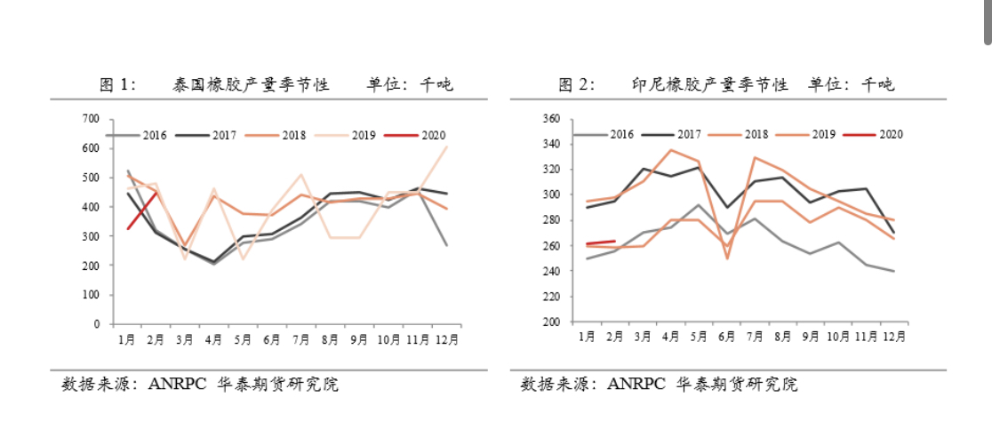
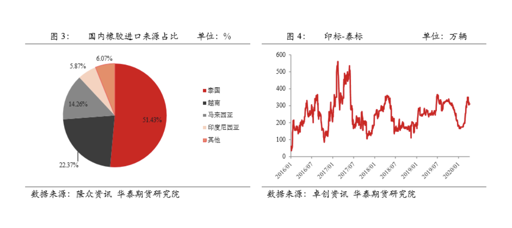

# 橡胶

- 成本 （9000-10000）

- 主产区 (每年的四五月份是割胶期,11 月份左右停割期)

  - 泰国
    - 国内天胶 9600 20 号天胶 7800 原油 20 美元 杯胶弃割线为 32 泰铢/公斤
  - 马来西亚
  - 印度 （主要供内销）
  - 越南（未来可能会产量大增，橡胶树大概种 6 年左右可以割胶水）
  - 中国（云南、海南）---大部分全乳胶

- 交割制度

  - 根据上期所的制度，全乳胶仓单具有时效性，也就是前一年的老胶仓单必须在当年最后一个合约 11 月合约结束后集中注销

- 复合胶(非标套利)
  - 复合胶，是一种在天然橡胶中添加了 2.5%合成胶以及 0.5%硬脂酸的橡胶（非标套利的现货），由于其绝大部分成分是天然橡胶且使用性能也与天然橡胶相差不大，因此通常也被看做是天然橡胶的一种，复合胶作为期现套利标的有其独到的优势：与全乳胶相比，复合胶产量大供应充足且轮胎厂接受度高流动性好。与标准胶相比，复合胶由于不需要缴纳关税（复合胶关税其实与标准胶一样，但贸易商常以混合胶名义进口复合胶，因此仍享受零关税），因此货物到港后可以直接入关，无需提前寻找买家或者在保税区内寻找库位，并可以规避外汇风险
  - 复合胶，并不是沪胶的交割标的，因此复合胶套利不涉及交割。按照目前的套利成本，当期现价差大于 **2000 元/吨时**，贸易商就会开始逐步建仓，也就是进口复合胶并做空期货。建仓完毕后，贸易商开始等待价差回归，在价差未回归的情况下便向后移仓。与全乳胶相似，沪胶 09 合约最终一定会平水复合胶现货。由于使用性能相似，用胶企业在 09 合约上接货时会将仓单价格和复合胶现货比较，只有期货平水复合胶时，用胶企业才愿意接货。巨量库存在短时间内一次性释放容易造成现货和期货两个市场的踩踏，因此部分套利商在期现价差收窄至 1500 元/吨左右时就会逐步解仓,复合胶全部用于内销轮胎；而标准胶则用于出口胎。这其中原因和关税有关，目前标准胶进口需要缴纳 1500 元/吨的关税，而复合胶则是零关税。由于复合胶在生产中需要添加非天然成分，容易出现以次充好的情况。出于出口退税、美元授信额度和质量的考虑，轮胎企业倾向使用标准胶生产出口胎，以复合胶生产内销轮胎。
  - 我们所说的贸易商高库存指的是复合胶库存。期现套利商不以下游需求为导向疯狂进口复合胶的行为导致国内复合胶库存暴涨。但反观标准胶，由于其并不是常用的期现套利标的，因此进口不存在如复合胶那般“不理性”的行为，其国内库存也正常。如上文所述，由于在没找到买家前，进口的标准胶通常先存放于保税区，因此保税区天然橡胶库存基本可以反映国内标准胶的库存水平（复合胶库存计在合成胶中）。从图 13 可以看出，目前保税区天然橡胶库存其实是处于历史偏低水平的

> 中国 每年进口 500 万吨 天然橡胶 400 万吨 20 号天胶

> 轮胎产量的 40% 用于出口

### 青岛港口总库存

</img>

### 泰国印尼产量

</img>

### 橡胶进口占比

</img>

> 特性: 橡胶需要等橡胶树长出新叶子才能割胶，不然直接割胶会导致橡胶树死亡，白粉病 干旱会导致割胶期推后

什么是 20 号胶？

专家

20 号胶是天然橡胶的主流品种之一。橡胶主要分为天然橡胶和合成橡胶。天然橡胶是指从巴西橡胶树上采集的天然胶乳，经过凝固、干燥等加工工序而制成的弹性固状物。合成橡胶是由人工合成的高弹性聚合物，也称合成弹性体，广义上指用化学方法合成制造的橡胶，以区别于从橡胶树生产出的天然橡胶。天然橡胶按形态可分为两大类：固体天然橡胶（胶片与标准胶）和浓缩乳胶（海关税则号下称为“天然胶乳”）。固体天然橡胶有传统制法和标准制法之分：传统制法生产胶片（烟胶片等），标准制法生产标准胶。标准胶，即技术分级橡胶（Technically Specified Rubber，简称 TSR），是按杂质、灰分、氮含量、挥发分、塑性初值、塑性保持率及色泽指数等理化性能指标进行分级的橡胶。根据国家标准和 ISO 标准，标准胶按照原料和性能的不同主要分为以下几类：LoV（低黏恒黏胶，Low Viscosity Constant Viscose）、 CV（恒黏胶，Constant Viscose）、L（浅色胶，Light-colored Rubber）、WF（全乳胶，Whole Field Latex Rubber）、5 号胶、10 号胶、20 号胶、10 号恒黏胶（10CV）和 20 号恒黏胶（20CV）。

投资者

20 号胶如何进行标识、包装及运输？

专家

标识：20 号胶，统称 TSR 20。具体到各国生产的 20 号胶，使用“S*R 20”代号，其中“S”代表“标准”，“*”代表生产国（泰国“T”、印尼“I”、马来西亚“M”、中国“C”等），“R”代表“橡胶”，“20”代表 20 号级别。在每个胶包外袋正面有标准胶级别代号，其中 20 号胶的级别代号标志为红色。

包装：20 号胶每个胶块一般净重 35 千克。胶块用聚乙烯薄膜包裹，聚乙烯薄膜厚度为 30-65μm，维卡耐热度小于 95 摄氏度。

每托 20 号胶胶包由 36 个胶块组成，外包装符合托盘紧缩包装要求，该托盘可以用于货架存取和堆码。每托胶包外应当标志注明标准橡胶级别代号、净重、生产企业名称、生产工厂代码、生产日期等。

运输：胶包运输时须用干燥、清洁的集装箱或车厢等运输，盖好篷车，以防阳光晒或雨水淋湿导致橡胶发霉变质。

投资者

20 号胶的生产工艺和流程是怎样的？

专家

20 号胶的生产工艺包括原料预处理、清洗、破碎、压绉、造粒、烘干、压包等工序，其中关键步骤是破碎、压绉和烘干。

以泰国 20 号胶（STR20）为例，初级原料来自成千上万个种植农户的杯胶（Cup Lump），以及种植农户简单处理后的生片（USS）和烟胶片（RSS），通常将上述原料按照一定的配方比例进行混合加工。加工时，由于原料在割胶、运输和储存过程中会混入木屑、沙子等非胶物质，故生产加工前需对原料进行分选、冲洗等预处理工序，并在生产过程中进行多次清洗、破碎、压绉等工序，一方面可去除原料中的非胶物质，另一方面可通过加工过程提高橡胶的理化性能指标。经过上述多道工序后的橡胶经过造粒机，造粒成直径小于 0.25 厘米的不规则形状的小粒，再进入烘干工序，然后将烘干后的半成品进行压包，包装成重量和形状标准化的天然橡胶。部分工厂也采用“干搅”工艺来生产 20 号胶，此类生产工艺相对简单，产品的均一性较差；用于能源中心 20 号胶期货交割的商品不可经干搅工艺制得。

投资者

20 号胶的主要用途是什么？

专家

天然橡胶具有优良的回弹性、绝缘性、隔水性及可塑性等特性，并且经过适当处理后还具有耐油、耐酸、耐碱、耐热、耐寒、耐压、耐磨等宝贵性质，所以具有广泛用途。轮胎、胶管、胶带、鞋材是天然橡胶主要的下游应用领域。其中，全球约 70%的天然橡胶用于轮胎制造，10%用于橡胶管带，10%用于鞋材，10%用于其他橡胶制品。轮胎制造所使用的天然橡胶中，约 80%为 20 号胶；20 号胶的使用已成为一个国家轮胎工业技术与工艺水平的主要标志。

投资者

20 号胶与全乳胶有什么异同？

专家

20 号胶与全乳胶（WF）都是天然橡胶的一种，但在初级原料状态、加工工艺、贸易模式、最终用途、增值税率等方面存在一定差异。原料方面，全乳胶以新鲜胶乳为原料加工而成，产品杂质含量低，加工工艺链条短。而 20 号胶主要采用杯胶和种植户简单处理后的生片和烟胶片为原料，原料具有多样性，规模化方面具有明显优势。由于原料的不同，全乳胶和 20 号胶在加工工艺上的主要不同在于原料的预处理上。

终端用途方面，全乳胶主要用于以浅色胶为主要需求的橡胶制品，也用于轮胎。目前 20 号胶主要广泛运用于轮胎行业。

增值税率方面，根据财政部、国家税务总局、海关总署 2019 年 3 月 21 日联合发布的《关于深化增值税改革有关政策的公告》，自 2019 年 4 月 1 日起，进口天然橡胶（20 号胶）增值税率从 16%降至 13%，国产天然橡胶（全乳胶）增值税率从 10%降至 9%。

投资者

天然橡胶涉及的相关法律法规和政策有哪些？

专家

① 政府相关管理部门：天然橡胶产业受到农业农村部、商务部、生态环境部、国家林业和草原局、海关总署等多部委的监管和支持。② 关税：我国对进口天然橡胶征收关税，天然橡胶的进出口需关注海关总署等发布的相关关税及出口退税等规定。③ 国储政策：我国建立有天然橡胶的国家储备制度，在胶价急剧波动时通过收储、出售来稳定市场。④《中华人民共和国森林法》及其实施条例：橡胶林木属于经济林，其培育种植、采伐利用和经营管理均需遵守《中华人民共和国森林法》及《中华人民共和国森林法实施条例》。⑤ 轮胎行业规划及政策：轮胎行业作为 20 号胶的主要下游应用领域，其行业规划及产业政策对 20 号胶产业都会产生重要影响。

二、20 号胶国际供需及贸易

投资者

全球 20 号胶生产情况如何？

专家

2018 年，全球 20 号胶年产量逾 870 万吨，其中泰国、印度尼西亚和马来西亚是 20 号胶的主产国，三国产量约占全球的 70%。从三大主产国内部来看，20 号胶产业呈现不同程度的充分竞争格局。

我国适合植胶的地理气候区域有限，主要集中在海南、云南南部、广东等少数地区。我国天然橡胶加工主要以胶园胶乳为原料，生产以 SCR WF 胶（全乳胶）为主导产品的各种标准橡胶，20 号胶产量较小，规模化程度相对较低，部分民营企业亦参与天然橡胶的加工生产。

投资者

全球 20 号胶消费情况如何？

专家

全球天然橡胶年消费逾 1300 万吨，中国、欧洲、印度、东亚（包括日本和韩国）和美国是前五大消费国（地区），其消费量分别约占总消费量的 40%、9%、9%、8%、7%；五国（地区）消费量占总消费量的 73%。

交通运输中的轮胎制造是主要用胶行业。全球约 70%的天然橡胶用于轮胎制造，其中约 80%使用 20 号胶。2018 年，全球 20 号胶消费近 830 万吨，中国、欧洲、印度、东亚和美国的 20 号胶消费量分别约占总消费量的 50%、10%、7%、9%、8%；五国（地区）消费量占总消费量的 83%。

投资者

20 号胶贸易流通情况如何？

专家

因我国产量有限，我国天然橡胶消费主要依赖于进口。我国进口的天然橡胶主要来自于泰国、马来西亚和印度尼西亚，三国占我国天然橡胶进口量超过七成。

20 号胶的现货贸易流向主要从泰国、马来西亚、印度尼西亚等东南亚国家流向我国沿海地区，一部分制成轮胎再出口，另一部分由沿海向内陆分散。青岛、上海、杭州、宁波、天津、南京等为我国天然橡胶和 20 号胶进口的主要口岸。

20 号胶的流通环节呈现多元化格局。20 号胶的销售可以大致分为长期订单模式、贸易商模式和代理商模式。
